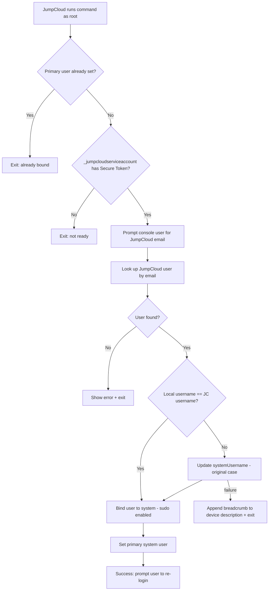

<div align="center">

# Automatic Account Takeover for macOS

**Automatically takes over the existing local macOS account and binds it to the correct JumpCloud user during onboarding — no manual admin work.**

[](https://www.gnu.org/software/bash/)
[](#prerequisites)
[](https://jumpcloud.com/)
[](LICENSE)
[](#overview)

</div>

> 🪟 **Looking for the Windows version?** See
> [automatic-account-takeover-windows](https://github.com/rahultestingjc/automatic-account-takeover-windows).

---

## Overview

Onboarding a customer's fleet to JumpCloud usually means an admin manually touching every
device — matching local accounts to JumpCloud identities, binding systems, and setting the
primary user one by one. It's slow, error-prone, and doesn't scale.

This tool replaces that manual work with **self-service, MDM-dispatched automation**. The
script runs on the Mac, prompts the logged-in user for their JumpCloud email, looks up their
account, reconciles the macOS username with the JumpCloud username, binds the device, and sets
the primary user — with full logging and graceful handling of the messy real-world states
devices show up in.

> **The result:** a complicated, multi-step per-device process that normally takes about half
> an hour becomes a roughly one-minute, user-driven action.

---

## Table of Contents

- [Highlights](#highlights)
- [At a glance](#at-a-glance)
- [How it works](#how-it-works)
- [What the user sees](#what-the-user-sees)
- [Repository structure](#repository-structure)
- [Prerequisites](#prerequisites)
- [Deployment](#deployment)
- [Configuration](#configuration)
- [Output & logging](#output--logging)
- [License](#license)

---

## Highlights

- 🔗 **Automatic account takeover & binding** — links the existing local macOS account to the
  correct JumpCloud user with no manual admin lookup.
- 🔐 **Secure Token gate** — only proceeds if `_jumpcloudserviceaccount` exists **and** has
  Secure Token enabled, avoiding half-bound states on Macs that aren't ready.
- 🧠 **Case-preserving username reconciliation** — compares usernames case-insensitively but
  writes back the user's original case via `systemUsername`.
- 🧾 **Diagnostic breadcrumbs** — on failure, appends a timestamped note to the device's
  JumpCloud description (without clobbering existing content) and logs everything locally.

---

## At a glance

| Script | Platform | What it solves | Time saved |
|--------|----------|----------------|------------|
| [`jc_bind.sh`](scripts/device-enrollment/macos/jc_bind.sh) | macOS (Bash) | Takes over the local account and binds the device to the correct JumpCloud user during enrollment | Replaces a manual, multi-step per-device admin task with a roughly one-minute, user-driven action |

---

## How it works

`jc_bind.sh` runs as **root** (dispatched as a JumpCloud Command) and moves through a guarded,
fail-safe pipeline. It exits early if the device is already bound, waits for the device to be
genuinely ready, and surfaces any failure to the user while logging diagnostics.



> [!IMPORTANT]
> **The JumpCloud identity is bound to whoever is logged in when the script runs.** It detects
> the current console user, shows the email prompt to *that* user, and binds the JumpCloud
> identity (resolved from the email they enter) to *that same* local account. Therefore it must
> run while the **intended end user is signed in** — do **not** trigger it from an IT admin
> session or a different local account, or the device will be bound to the wrong identity.

---

## What the user sees

The entire experience for the end user is two simple dialogs — enter an email, then confirm.

<!--
  📸 SCREENSHOT PLACEHOLDER
  Add macOS screenshots of the osascript dialogs to docs/screenshots/ and
  reference them below (e.g. email-prompt.png and success-dialog.png).
-->
*📸 Screenshots coming soon — add the macOS email prompt and success dialog here.*

---

## Repository structure

```
automatic-account-takeover-macos/
├── README.md
├── LICENSE
├── .gitignore
├── docs/
│   └── screenshots/          # add UI / result screenshots here
└── scripts/
    └── device-enrollment/
        └── macos/
            └── jc_bind.sh
```

---

## Prerequisites

- A macOS device **managed by JumpCloud** (enrolled agent).
- `_jumpcloudserviceaccount` present with **Secure Token enabled** (the script gates on this).
- A JumpCloud **API key** with permission to:
  - read system users (`GET /systemusers`)
  - update system users (`PUT /systemusers/{id}`)
  - create user↔system associations (`POST /v2/users/{id}/associations`)
  - read/update systems (`GET`/`PUT /systems/{id}`)
- The script runs as **root** and a real interactive user must be logged in at the console.

---

## Deployment

This script is designed to be dispatched from JumpCloud as a **Command** (run as `root`)
targeting macOS devices.

1. In the JumpCloud Admin Console, create a new **Command** with the trigger set to **after
   Agent Install** → **Mac** → command type **Bash**.
2. Paste the contents of
   [`jc_bind.sh`](scripts/device-enrollment/macos/jc_bind.sh).
3. Provide the required values for the configuration placeholders (see
   [Configuration](#configuration)).
4. Install the JumpCloud agent on the target device(s). The logged-in user will see an email
   prompt, then a notification that enrollment is complete asking them to **sign out and sign
   back in**.

> [!NOTE]
> **Run at agent registration _or_ on demand.** With the "after Agent Install" trigger the
> command runs automatically when the agent registers. If you'd rather **not** bind the
> JumpCloud user at registration time, skip that trigger and run the same command **on demand**
> whenever you choose.

---

## Configuration

These placeholders at the top of the script are substituted by JumpCloud at dispatch time:

```bash
API_KEY={{Apikey}}
ORG_ID={{OrgID}}
SYSTEM_ID={{device.id}}
PRIMARY_USER_ID={{device.primary_user_id}}
```

- **`{{Apikey}}`** — an **Automation Variable** a JumpCloud admin must create in the Admin
  Console. JumpCloud substitutes it at dispatch time, so the real key never lives in source.
- **`{{OrgID}}`** — an **Automation Variable** for multi-tenant orgs (optional; sent as the
  `x-org-id` header when present).
- **`{{device.id}}`** and **`{{device.primary_user_id}}`** — **built-in** command variables,
  resolved **automatically** by JumpCloud Commands; no setup required. A non-empty, non-zero
  primary user ID makes the script exit early (device already bound).

> ⚠️ **Never hardcode a real API key.** Use a JumpCloud **Automation Variable** so the key is
> injected only at dispatch time. For manual testing, export the values as environment
> variables and lock the script down (`root:wheel`, `700`).

> 🌍 **EU-region tenants:** if your JumpCloud org is in the EU region, change `JC_BASE` in the
> script from `https://console.jumpcloud.com` to `https://console.eu.jumpcloud.com`.

---

## Output & logging

| Path | Purpose |
|------|---------|
| `/var/log/jc_bind.log` | Timestamped execution log of every step (mode `600`) |
| `/var/tmp/jc_user_email.txt` | The email the user entered (transient; removed on exit) |

On failure of the username update, a timestamped breadcrumb (local user, JC username, email,
HTTP status, and a truncated error) is **appended** to the device's **description** field in
JumpCloud — existing content is preserved, not overwritten.

---

## License

Released under the [MIT License](LICENSE).

---

<div align="center">

Built to make JumpCloud onboarding effortless. ⚡

</div>
